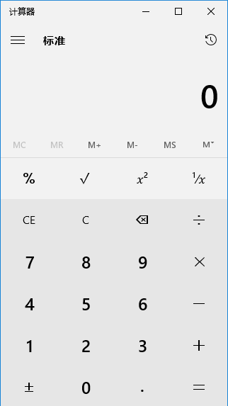

# Calculator
计算器界面是模仿win10自带的计算器（自己手写），顶部是一个显示框Jlabel，底部是16个button，消除了按钮的边框，底部用的网格布局 
编译器是IDEA。 
在Calculator类中运行 
Calc类根据运算式计算出结果并返回 
还有两个是测试类。。。 
为了方便，没有加入提示，一些非法等式不能计算，比如-10开根号 
 
1.计算器可以根据屏幕分辨率调整合适的大小 
2.可以根据显示的内容调整字体大小 
3.可以进行复杂的计算 
4.加入了平方、开方、倒数、阶乘（100以下的阶乘） 

### 界面

